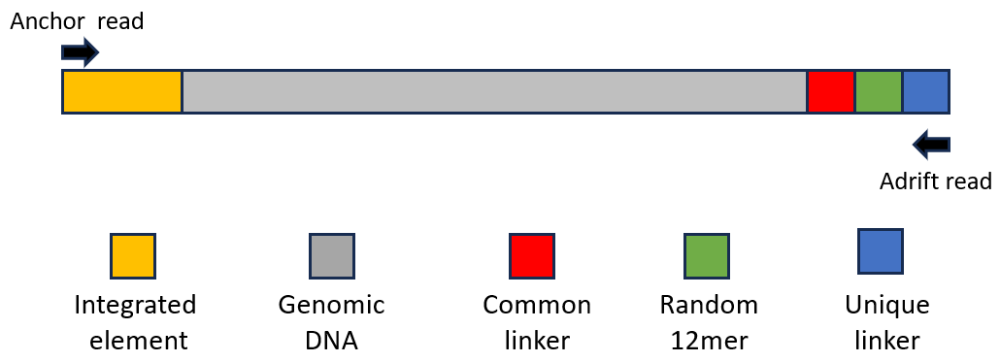
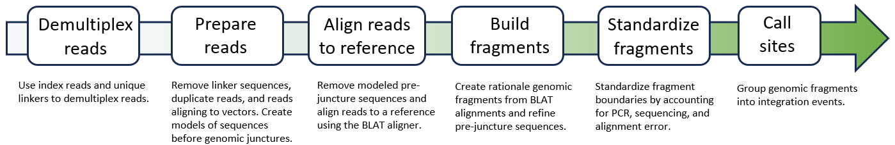

# Implementation  

AAVengeR is written in the R programming language and is designed to run on a single server with modest resources while its modular design can be easily adapted to more distributive solutions such as Nextflow and cloud computing platforms. The software is driven by two configuration files, one that defines processing parameters for each module and a second that describes experimental samples. The sample configuration file contains sample specific details such as barcode and linker sequences, vector details, and reference genomes.  AAVengeR modules can be chained together to create custom pipelines and custom modules can be used by simply adding them to module chain lists and adding their parameters to the software configuration file.
  
  
# Installing additional AAVengeR genomes and genome annotations   

Due to GitHub size restrictions, only the sacCer3 genome and annotation files are provided 
with the software. Additional genomes and genome annotations are available: hg38, mm9, canFam3, macFas5, and GCA_009914755.4. 
The importGenomeData.R script can be used to pull reference genomes (2bit format) and supporting genome annotations.

```
importGenomeData.R hg38
```

# Usage

AAVengeR requires two configuration files. The [first configuration file](config.yml) contains the list of modules to run, module specific processing paramers, paths to resources, and the path to the second configuration file which defines sample specific parameters. The [sample configuration file](sampleData.tsv) contains sample specific information such as barcode sequences for demultiplexing, linker sequences, and reference genome against which reads should be aligned.  
  
```
aavenger.R config.yml
```


# Overview  

Gene therapy introduces new genetic material to patient cells designed to augment the expression of genes or encode machinery to make specific changes to cellular genomes. Several therapies, specifically those that make use of retroviral vectors, can result in millions of genomic integrations throughout the genome which raises the concern of genotoxity.  Integrated vectors, by means of disrupting regulatory elements, promotor insertion, interrupting transcript splicing, can disrupt the normal transcription patterns of genes. Therapies that make use of non-intgegrating vectors, such as Adenosine-associated Virus (AAV), are not immune to integration events where episomal constructs are captured by nonhomologous end joining pathways during double strand break repair. The identification of integrated genomic positions and estimation of clonal population with specific integrations is critical to the field of molecular medicine.  

AAVengeR is a collection of software modules that provide a general solution for identifying and characterizing DNA integration events where the only requirement is that integrated elements include PCR priming sequences not commonly found in reference genomes. The software makes use of paired-end sequencing data of sheered genomic DNA libraries where one read sequences outward from integrated elements through genomic DNA junctures.  Integrated elements may include lentiviral proviruses, transposons, integrated AAV vectors and oligonucleotide captured via non-homologous end joining double strand break repair. The AAVengeR integration pipeline expects sequenced fragments to include sample specific linker sequences for sample demultiplexing and unique molecular identifier (UMI) sequences for clonal abundance estimations. (Figure 1). These elements can be added post facto to accommodate data generated with different protocols. Due to limitations of library preparations, sequencing depth, and large repetitive regions of reference genomes, AAVengeR typically will not return every integration site but rather return integrations from more abundant clones and a sampling from less abundant clones.  

Figure 1. AAVengeR paired-end sequencing library structure. 
<p align="center"></p>

# Approach  

AAVengeR provides six core modules to call integration sites from raw sequencing data (Figure 2). The demultiplex module quality trims reads and assigns reads to samples using both index barcode as well as unique linker sequences ligated onto genomic fragments. Next reads are prepared for alignment to a reference by removing linker sequences, duplicate reads, and reads aligning to the vector.  For integrated elements whose edges have an expected structure, such as retrovirus and transposons, Hidden Markov Models (HMM) are used to model pre-genomic juncture sequences. For elements with irregular or rearranged edges, such as AAV integrations, local sequence alignments against vector sequences are used to model pre-genomic juncture sequences. The next module removes sequences preceding junctures since they can influence alignments to reference genomes and then aligns reads to the reference using the BLAT aligner. BLAT was chosen over faster aligners such as BWA and Bowtie because it is more tolerant of mismatches near the ends of alignment and returns all alignments rather than those deemed likely by aligner algorithms. Since BLAT is not a paired-end read aligner, the following module uses the forward and reverse read alignments to create rationale genomic fragments where read mates align within 20KB of one another and their alignments face one another. The boundaries of genomic fragments are refined in the next module where small boundary variations arising from PCR, sequencing, and alignment errors are standardized. The final core module groups genomic fragments into integration events and estimates clonal abundances by tallying unique UMIs sequences and genomic fragment lengths. AAVengeR includes additional modules for characterizing integration events such as distances to nearest genes, predicting PCR artifacts, and characterizing the rearrangement of pre-genomic juncture sequences. 

Figure 2. AAVengeR core pipeline. 
<p align="center"></p>

# Structure  

Structure of AAVengeR data folder
```
AAVengeR
└── data
    ├── genomeAnnotations
    │   ├── sacCer3.TUs.rds
    │   ├── sacCer3.exons.rds
    │   └── sacCer3.repeatTable.gz
    ├── hmms
    │   ├── HXB2_U5.hmm
    │   └── HXB2_U5.settings
    ├── referenceGenomes
    │   └── sacCer3.2bit
    └── vectors 
        └── HXB2.fasta
```

The AAvengeR data folder contains four subfolders. The hmms folder contains hmm files created with the [HMMER](http://hmmer.org) software package using either multiple sequence alignments or single DNA sequences as inputs. 
Each HMM profile has a coresponding settings file that contains the default parameters for evaulating and scoring the HMM. These settings are applied if the the prepReads_useDefaultHMMsetting parameter in the main configuration
file is set to TRUE other wise the HMM parameters in the main configuration file are used.

Example of an HMM setting file
```
prepReads_HMMsearchReadStartPos: 1
prepReads_HMMsearchReadEndPos:  16
prepReads_HMMmaxStartPos: 3
prepReads_HMMminFullBitScore: 5
prepReads_HMMmatchEnd: TRUE
prepReads_HMMmatchTerminalSeq: CA
```


```
SW_score        percent_div     percent_del     percent_ins     query_seq       query_start     query_end       query_after     strand  repeat_name     repeat_class    repeat_start    repeat_end      repeat_after    ID      alt
34      0       0       0       chrIX   11364   11392   (428496)        +       (TA)n   Simple_repeat   1       29      (0)     1       NA
18      8.5     0       0       chrIX   22808   22832   (417056)        +       (A)n    Simple_repeat   1       25      (0)     2       NA
14      15.9    0       0       chrIX   27205   27232   (412656)        +       (TGA)n  Simple_repeat   1       28      (0)     3       NA
17      14.2    3.2     0       chrIX   28527   28557   (411331)        +       (TA)n   Simple_repeat   1       32      (0)     4       NA
19      28.2    4.9     0       chrIX   39531   39612   (400276)        +       A-rich  Low_complexity  1       86      (0)     5       NA
19      23.3    0       0       chrIX   44119   44168   (395720)        +       (ACCTCC)n       Simple_repeat   1       50      (0)     6       NA
14      9.6     0       0       chrIX   44279   44301   (395587)        +       (CCA)n  Simple_repeat   1       23      (0)     7       NA
15      11.2    3.5     0       chrIX   46885   46913   (392975)        +       (TAA)n  Simple_repeat   1       30      (0)     8       NA
```


