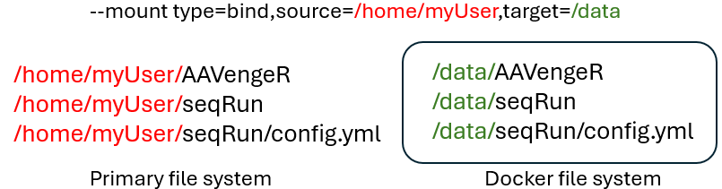

# Quick Start

Clone this repository and install one or more precompiled genomes. 

```
%> git clone https://github.com/helixscript/AAVengeR
%> cd AAVengeR

%> ./aavenger.R --list_available_genomes
   Available genomes:

   refGenome   dataSize 
   ----------- ----------
     canFam3     13 GB   
      hg38       17 GB   
       hs1       17 GB   
      mm10       15 GB   
       mm9       15 GB   
    rheMac10     16 GB   
     sacCer3     68 MB   

%> ./aavenger.R --install_genome sacCer3
%> ./aavenger.R --install_genome hg38
```

AAVengeR requires two configuration files. The [first configuration file](config.yml) contains the list of modules to run, module specific processing parameters, paths to resources, and the path to the second configuration file which defines sample specific parameters. The [sample configuration file](sampleData.tsv) contains sample specific information such as barcode sequences for demultiplexing, linker sequences, and reference genome against which reads should be aligned. Typically, only parameters near the top of the configuration file need to be changed such as those pointing to sequencing data, the sample configuration file, module chain, and the name of the output directory.  
  
AAVengeR pushes data through a series of modules defined in the 'modules' section of the configuration. The core modules are: demultiplex, prepReads, alignReads, buildFragments, buildStdFragments and buildSites. Rather than chaining these modules together in the 'modules' section, it is often more advantageous to simply call the 'core' module. This module calls the six core modules and dynamically allocates CPUs to each process depending on the number of demultiplexed reads. The pipeline creates log files for each module and continuously collates them in real time to a single master log file found in outout/log  ([example master log](figures/exampleLog.txt)). When using the core module, a job table will be found in the master log file to help track the progress of pipeline jobs. Another benefit of using the core module rather than chaining together modules is the creation of read attrition plots. These plots are embeded within the master log and a complete collection of plots is available in output/core/readAttritionReport.txt ([example report](figures/exampleReadAttritionReport.txt)).
  
When both configuration files are ready, the pipeline is launched with this command:
  
```
%> ./aavenger.R config.yml
```

The AAVengeR pipeline is written in both R and Python and requires several software libraries and third party tools to run. In order to simplify its installation and standardize its behavior, a [precompiled Docker image](https://bushmanlab.org/data/AAVengeR/docker/aavenger.tar.gz) is available and recommended. 

# Working with Docker  

The provided Docker image can be imported with this command:
```
%> docker load < aavenger.tar.gz
```
  
The Docker container expects you to 'bind' a file directory containing all the files needed for the analysis (AAVengeR, FASTQs, and configuration files) to the container at run time. Within the container, the directory will be bound to */data*. 
For example, if AAVengeR and your data files are all located in your home directory */home/myUser*, these parameters would bind your home directory to the container when it starts:
<p align="center">
  
</p>
  
The container needs to know the location of AAVengeR and its configuration file. These paths are provided in the command to start the container. **Importantly, these paths, and the paths included in your AAVengeR configuration file, need to be written from the container's perspective**. For example, if you installed AAVengeR at */home/myUser/AAVengeR* and bound */home/myUser* to the container's */data* directory, the path to AAVengeR would be */data/AAVengeR*. Putting it all together: 

```
%> docker run --rm --mount type=bind,source=/home/myUser,target=/data -e CONFIG_PATH=/data/seqRun/config.yml aavenger
```

# Setting up the sample configuration file

The [sample configuration file](sampleData.tsv) provides AAVengeR information about sequencing library. Sequenced amplicons are expected to have the structure defined in the [2016 INSPIIRED paper](https://pubmed.ncbi.nlm.nih.gov/28344990). Reads originating from within LTR or ITR sequences and transverse genomic junctures are referred to as *anchor reads* because they anchor sequencing reads to integration positions. Reads originating from within ligated linkers at the opposite ends of fragments are referred to as *adrift reads* because their alignment positions drift due to the genome being sheared during library preparation. For each sample replicate, the sample configuration file will need the sequence of the adrift linker (eg. GTTAAAGGTGTTCCCTGCCGNNNNNNNNNNNNCTCCGCTTAAGGGACT) and I1 barcode (eg. ACCTAAGTCCGT).

<p align="center">
  
</p>

In addition to this sequence information, the sample configuration file needs information about the reference genome against which to align your data (refGenome), information about your vector (vectorFastaFile), information about how to recognize the ends of LTR sequences (leaderSeqHMM), and processing details (flags).

**refGenome**: use one of the reference genome identifiers provided by ./aavenger.R --list_installed_genomes  
  
**vectorFastaFile**: given the repetitive nature of LTR sequences and AAV's tendency to self-integrate, vector sequences are needed to remove reads that read into vector bodies rather than into flanking genomic DNA. Vector FASTA files should be placed in the *AAVengeR/data/vectors* folder and the name of the file placed in this column. It is important that the vector sequence uses capital letters. Lowercase letters are ignored and are used for more advanced analyses.  
  
**leaderSeqHMM**: (retroviral analyses only -- omit for AAV analyses) AAVengeR recognized the ends of LTR sequences using vector specific HMMs (Hidden Markov Models) which should be placed in the *AAVengeR/data/hmms* folder. HMMs will be discussed in depth next.  

**flags**: This column provides additional information about how to process samples.<br>
 &nbsp; &nbsp; (mode: integrase) &nbsp; &nbsp; **IN_u5**: anchor read is reading out of LTR U5 into genomic DNA.<br>
 &nbsp; &nbsp; (mode: integrase) &nbsp; &nbsp; **IN_u3**: anchor read is reading out of LTR U3 into genomic DNA.<br>
 &nbsp; &nbsp; (mode: AAV) &nbsp; &nbsp; &nbsp; &nbsp; &nbsp; &nbsp; **AAV**: sample is an AAV integration sample.<br>
 &nbsp; &nbsp; (mode: manual) &nbsp; &nbsp; &nbsp; &nbsp;**none**: place holder for other analyses.<br>  

# Working with HMMs
Anchor reads containing the ends of vector LTR sequences are recognized using vector specific HMMs. HMMs are used because them are particularly adept at recognizing mismatches and minor indels that can occur due to natural variation and sequencing error.  Vector HMMs are created with the HMMER software package for each vector used in your analysis. To create a vector HMM, first create a FASTA file for the expected vector sequence you expect to observe in your R2 read sequences. This will be the expected sequence observed before transitioning into genomic DNA, eg.
```
>mySeq
GAAAATCTCTAGCA
```

Next, use HMMER to create a HMM with this FASTA file.
```
%> hmmbuild mySeq.hmm mySeq.fasta
```
Now that we created an HMM, we need to determine how to score it. Next create a FASTA file containing minor variations in your sequence to see how it affects the HMM score. For example, here we create a file name *mySeqTests.fasta* and make minor changes which we would still consider valid hits.
``` 
>mySeq
GAAAATCTCTAGCA
>mySeq_1SNP
GAAGATCTCTAGCA
>mySeq_2SNPs
GAAGATCTCAAGCA
>mySeq_1del
GAAAATTCTAGCA
>mySeq_1del_1ins
GAAATCTCTGAGCA
```
Once we create a couple of minor variations in our target sequence, we evaluate the variations with our HMM.
```
hmmsearch --max --domtblout mySeqTests.domTbl mySeq.hmm mySeqTests.fasta
```

```
#                                                                            --- full sequence --- -------------- this domain -------------   hmm coord   ali coord   env coord
# target name        accession   tlen query name           accession   qlen   E-value  score  bias   #  of  c-Evalue  i-Evalue  score  bias  from    to  from    to  from    to  acc description of target
#------------------- ---------- ----- -------------------- ---------- ----- --------- ------ ----- --- --- --------- --------- ------ ----- ----- ----- ----- ----- ----- ----- ---- ---------------------
mySeq                -             14 mySeq                -             14     6e-05    9.5   0.0   1   1     6e-05     6e-05    9.5   0.0     1    14     1    14     1    14 0.90 -
mySeq_1SNP           -             14 mySeq                -             14   0.00035    7.7   0.0   1   1   0.00035   0.00035    7.7   0.0     1    14     1    14     1    14 0.87 -
mySeq_2SNPs          -             14 mySeq                -             14    0.0022    5.8   0.0   1   1    0.0021    0.0021    5.9   0.0     1    14     1    14     1    14 0.84 -
mySeq_1del           -             13 mySeq                -             14    0.0051    5.0   0.0   1   1     0.005     0.005    5.0   0.0     3    14     2    13     1    13 0.65 -
mySeq_1del_1ins      -             14 mySeq                -             14     0.019    3.7   0.0   1   1     0.017     0.017    3.8   0.0     3    10     2     9     1    14 0.69 –
```
Examine the HMM scores in column 9 (full sequence score) and make a decision about the lowest score that provides an acceptable match. In this example, we will go with 5.0. Next we will create an settings file for the new HMM. This file needs to have the same name as the HMM file except we replace ".hmm" with ".settings". The settings file provides default scoring parameters for the HMM. Here is an example:

```
prepReads_HMMsearchReadStartPos: 1  # Anchor read position to start searching for an HMM match.
prepReads_HMMsearchReadEndPos:  16  # Anchor read postion to stop looking for an HMM match, typicaly a couple NT past expected position.
prepReads_HMMmaxStartPos: 3         # Max. read position that an HMM match can begin.
prepReads_HMMminFullBitScore: 5     # Min. score for accepting an HMM hit.
prepReads_HMMmatchEnd: TRUE         # (True/False) Require a match to the end of the HMM.
prepReads_HMMmatchTerminalSeq: CA   # If prepReads_HMMmatchEnd is True, these letters must be matched to accept the hit.  
```
Settings in HMM settings files will be used to score their respective HMMs if *prepReads_useDefaultHMMsettings* is set to True in AAVengeR's configuration file otherwise the settings in the main configuration file will be used. Both hmm and settings files need to be places in AAVengeR's data/hmms/ folder. 

# Configuring AAVengeR

AAVengeR's configuration file contains two main sections. Settings at the top are designed to be changed for each analysis. These settings point to data files and output locations. The remaining settings are divided into modules and typically do not need to be changed. Paths to resources and outputs can be relative from where the software is started or absolute. It is important to remember that paths should reflect the Docker container's bound file structure when using Docker.

**mode** -- The analysis mode must be set to either integrase, AAV, transposase, or manual. Modes are conveniences that set several of the [settings found in the lower sections](https://github.com/helixscript/AAVengeR/blob/76da0e02814513cd2115a99be5b085ebbdb3e59c/lib.R#L79) to appropriate values for different types of analyses. Analyses with vectors that make use of integrase (retroviruses) should set the mode to *integrase* while analyses of AAV integration should set the mode to *AAV* and analyses of transposons should set the mode to *transposase*. Setting the mode to *manual* will result in none of the lower settings being changed allowing for full control of AAVengeR. 
   
**core_CPUs** -- This setting defines the maximum number of CPU cores that the core module can work with. The core module will dynamically distribute CPUs to sample analyses depending on the number of reads demultiplexed for each sample. Keep in mind that memory requirements will incrase as you increase the number of cores. Module specific CPU limits, defined further down within the configuration file, are ignored When using the core module.

**outputDir** -- This setting defines the path to the output directory for the analysis. The directory will be created if it does not exists.

**softwareDir** -- This setting defines the path to your AAVengeR installation directory. 

**database_configFile** -- This setting defined the path to a MySQL / MardiaDB credential file (typically ~/.my.cnf). This file needs to contain an AAVengeR credential block in order to upload and download data from an AAVengeR database. 

**database_configGroup** -- This setting defines the name of an AAVengeR block within the *database_configFile* credential file. Setting this value to *none* disables all database features.  

**database_samplesConfigGroup** -- This setting defines the name of an AAVengeR sample database credential block within the *database_configFile* credential file. (in development)

**demultiplex_anchorReadsFile**  
**demultiplex_adriftReadsFile**  
**demultiplex_index1ReadsFile** --  File paths to Illumina paired-end sequencing data.

**demultiplex_sampleDataFile** -- This setting defines the path to the [sample configuration file](sampleData.tsv).

**modules** -- This setting stores the list of modules (and their order) that AAVengeR should be executed. Each module has its own set of parameters defined further down in the configuration file including data input and output paths.

# Module parameter injection  

The parameters for each modules are defined in the module specific sections of the AAVengeR configuration file. These parameters can be overridden by passing parameter directly to modules (example below). 
This is useful for when users want to run a module more than once but use different parameters each time.

```
modules:
  - core
  - callNearestGenes
  - callNearestGenes "callNearestGenes_outputDir:callNearestOncoGene,
                      callNearestGenes_columnPrefix:onocoGenes_,
                      callNearestGenes_geneList:/data/AAVengeR_3.0.6/data/geneLists/COSMIC_v10_genes"
  - annotateRepeats
```


