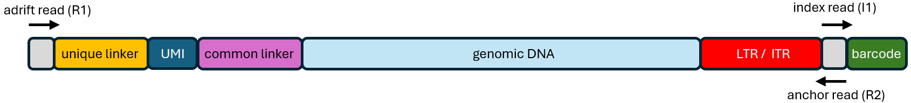

# Quick Start

Clone this repository and install one or more precompiled genomes. 

```
%> git clone https://github.com/helixscript/AAVengeR
%> cd AAVengeR

%> ./aavenger.R --list.available.genomes
   Available genomes:

   refGenome   dataSize 
   ----------- ----------
     canFam3     13 GB   
      hg38       17 GB   
       hs1       17 GB   
      mm10       15 GB   
       mm9       15 GB   
    rheMac10     16 GB   
     sacCer3     68 MB   

%> ./aavenger.R --install.genome sacCer3
%> ./aavenger.R --install.genome hg38
```

AAVengeR requires two configuration files. The [first configuration file](config.yml) contains the list of modules to run, module specific processing parameters, paths to resources, and the path to the second configuration file which defines sample specific parameters. The [sample configuration file](sampleData.tsv) contains sample specific information such as barcode sequences for demultiplexing, linker sequences, and reference genome against which reads should be aligned. Typically, only parameters near the top of the configuration file need to be changed such as those pointing to sequencing data, the sample configuration file, module chain, and the name of the output directory.  
  
AAVengeR pushes data through a series of modules defined in the 'modules' section of the configuration. There core modules are: demultiplex, prepReads, alignReads, buildFragments, buildStdFragments and buildSites. Rather than chaining these modules together in the 'modules' section, it is often more advantageous to simply call the 'core' module. This module calls the six core modules and automatically allocates CPUs to each sample depending on the number of demultiplexed reads. When using the core module, progress can be tracked through three key log files. The first log file, assuming your output directory is named 'output', would be 'output/core/demultiplex/log'. This file is updated in real time detailing the progress of the demultiplex module. Once the demultiplexing module finishes, 'output/core/replicateJobTable' will be created and show each sample replicate, the number of CPUs assigned to it, and its position and status in the queue. Finally, once replicate level analyses are complete, the 'output/cores/subjectJobTable' log will be created and report the progress of subject level analyses after which integration sites will be written to 'output/core'.
  
When both configuration files are ready, the pipeline is launched with this command:
  
```
%> ./aavenger.R config.yml
```

The AAVengeR pipeline is written in both R and Python and requires several software libraries and third party tools to run. In order to simplify its installation and standardize its behavior, a [precompiled Docker image](http://bushmanlab.org/data/AAVengeR/docker/aavenger_docker_v3.tar) is available and recommended. 

# Working with Docker  

The provided Docker image can be imported with this command:
```
%> docker load < aavenger_docker_v3.tar
```
  
The Docker container expects you to 'bind' a file directory containing all the files needed for the analysis (AAVengeR, FASTQs, and configuration files) to the container at run time. Within the container, the directory will be bound to */data*. 
For example, if AAVengeR and your data files are all located in your home directory */home/myUser*, these parameters would bind your home directory to the container when it starts:
<p align="center">
  
</p>
  
The container needs to know the location of AAVengeR and its configuration file. These paths are provided in the command to start the container. **Importantly, these paths, and the paths included in your AAVengeR configuration file, need to be written from the container's perspective**. For example, if you installed AAVengeR at */home/myUser/AAVengeR* and bound */home/myUser* to the container's */data* directory, the path to AAVengeR would be */data/AAVengeR*. Putting it all together: 

```
%> docker run --rm --mount type=bind,source=/home/myUser,target=/data -e AAVENGER_DIR=/data/AAVengeR -e AAVENGER_CONFIG_PATH=/data/seqRun/config.yml aavenger_docker_v3
```
# Running validation data sets
AAVengeR's *tests/* folder contains synthetic data sets created with the *buildSynReadData.py* script. This command will run the a small, synthetic integrase data set through the pipeline (update for your source path and AAVengeR variables as needed):

```
%> docker run --rm --mount type=bind,source=/home/myUser,target=/data -e AAVENGER_DIR=/data/AAVengeR -e AAVENGER_CONFIG_PATH=/data/AAVengeR/tests/small_integrase_config.yml aavenger_docker_v3
```
The output of this test will be located in *AAVengeR/tests/small_integrase_output*.


# Setting up the sample configuration file

The [sample configuration file](sampleData.tsv) provides AAVengeR information about sequencing library. Sequenced amplicons are expected to have the structure defined in the [2016 INSPIIRED paper](https://pubmed.ncbi.nlm.nih.gov/28344990). Reads originating from within LTR or ITR sequences and transverse genomic junctures are referred to as *anchor reads* because they anchor sequencing reads to integration positions. Reads originating from within ligated linkers at the opposite ends of fragments are referred to as *adrift reads* because their alignment positions drift due to the genome being sheared during library preparation. For each sample replicate, the sample configuration file will need the sequence of the adrift linker (eg. GTTAAAGGTGTTCCCTGCCGNNNNNNNNNNNNCTCCGCTTAAGGGACT) and I1 barcode (eg. ACCTAAGTCCGT).

<p align="center">
  
</p>

In addition to this sequence information, the sample configuration file needs information about the reference genome against which to align your data (refGenome), information about your vector (vectorFastaFile), information about how to recognize the ends of LTR sequences (leaderSeqHMM), and processing details (flags).

**refGenome**: use one of the reference genome identifiers provided by ./aavenger.R --list.installed.genomes  
  
**vectorFastaFile**: given the repetitive nature of LTR sequences and AAV's tendency to self-integrate, vector sequences are needed to remove reads that read into vector bodies rather than into flanking genomic DNA. Vector FASTA files should be placed in the *AAVengeR/data/vectors* folder and the name of the file placed in this column. It is important that the vector sequence uses capital letters. Lowercase letters are ignored and are used for more advanced analyses.  
  
**leaderSeqHMM**: (retroviral analyses only -- omit for AAV analyses) AAVengeR recognized the ends of LTR sequences using vector specific HMMs which should be placed in the *AAVengeR/data/hmms* folder. HMMs will be discussed in depth next.  

**flags**: This column provides additional information about how to process samples.<br>
 &nbsp; &nbsp; (mode: integrase) &nbsp; &nbsp; **IN_u5**: anchor read is reading out of LTR U5 into genomic DNA.<br>
 &nbsp; &nbsp; (mode: integrase) &nbsp; &nbsp; **IN_u3**: anchor read is reading out of LTR U3 into genomic DNA.<br>
 &nbsp; &nbsp; (mode: AAV) &nbsp; &nbsp; &nbsp; &nbsp; &nbsp; &nbsp; **AAV**: sample is an AAV integration sample.<br>
 &nbsp; &nbsp; (mode: manual) &nbsp; &nbsp; &nbsp; &nbsp;**none**: place holder for other analyses.<br>  

 .

   
